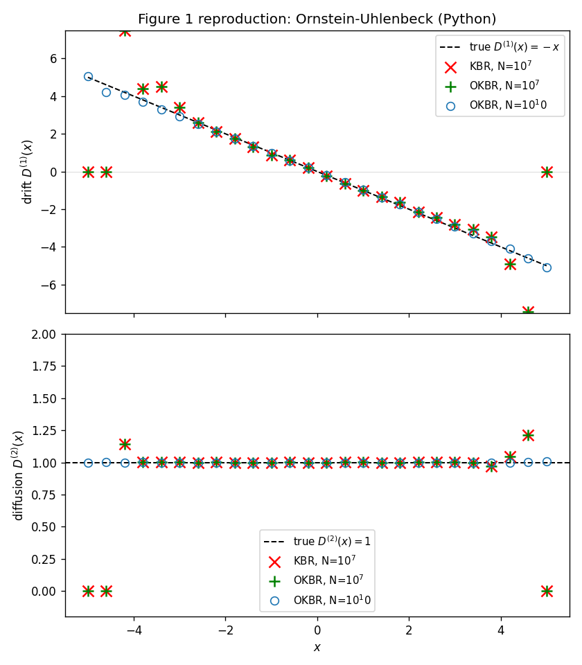
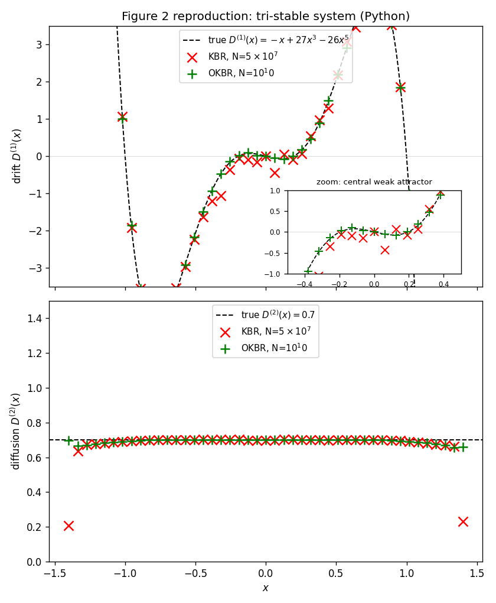
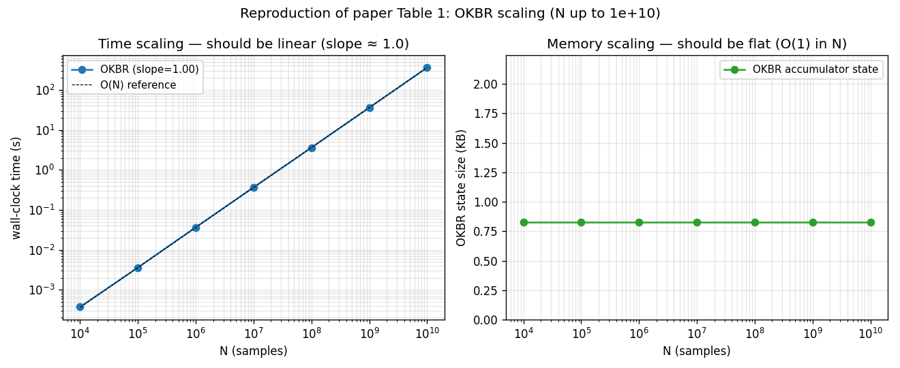

# online_moments

A Python port of [`OnlineMoments.jl`](https://github.com/williamjsdavis/OnlineMoments.jl) — streaming, $\mathcal{O}(1)$-space estimators for conditional moments of stochastic-process increments. Recovers the drift $D^{(1)}(x)$ and diffusion $D^{(2)}(x)$ of a Langevin SDE from time-series data of arbitrary length, including streamed data that does not fit in memory.

## Background

For a scalar stochastic process satisfying the Itô-interpreted Langevin SDE

$$\mathrm{d}X_t = f(X_t)\,\mathrm{d}t + g(X_t)\,\mathrm{d}W_t,$$

the Fokker–Planck equation has Kramers–Moyal coefficients

$$D^{(k)}(x) = \lim_{\tau \to 0} \frac{1}{k!\,\tau} \int (x' - x)^k\, p(x', t+\tau \mid x, t)\,\mathrm{d}x',$$

with $f(x) = D^{(1)}(x)$ (drift) and $g(x) = \sqrt{2 D^{(2)}(x)}$ (diffusion). The bridge between data and the Kramers–Moyal coefficients is the conditional moment

$$M^{(k)}(\tau, x) = \int (x' - x)^k\, p(x', t+\tau \mid x, t)\,\mathrm{d}x',$$

estimated on a $\tau$-grid as a $(N_\tau, N_x)$ matrix and reduced to $D^{(k)}(x) \approx M^{(k)}/(k!\,\tau)$ in the $\tau \to 0$ limit. The streaming kernel-weighted Welford recurrence at the heart of this package processes one new sample $X_N$ at a time:

$$\hat{M}^{(k)}_{ij}\big|_N = \hat{M}^{(k)}_{ij}\big|_{N-1} + K_h(\mathcal{X}_j - X_{N-i})\,\frac{(X_N - X_{N-i})^k - \hat{M}^{(k)}_{ij}\big|_{N-1}}{W_{ij}\big|_N},$$

with $W_{ij}$ the cumulative kernel weight per cell. Memory is $\mathcal{O}(N_\tau N_x)$ — independent of the stream length $N$. See `docs/theory.md` for the full set of update rules including the conditional-variance accumulator (paper eq. 16).

The method is described in:

> Davis, W. **Reconstruction of Stochastic Dynamics from Large Streamed Datasets.** *Phys. Rev. E* 108 (2023), 054110. [Article](https://doi.org/10.1103/PhysRevE.108.054110) · [Preprint](https://arxiv.org/abs/2307.00445)

## Install

The project uses [`uv`](https://docs.astral.sh/uv/) for environment management:

```bash
uv sync                                      # create venv + install package and dev deps from uv.lock
uv run pytest                                # run the 73-test suite
uv run python validation/figure_1_ou.py --smoke   # render validation figures
```

Python 3.12 is pinned via `.python-version`. All dependencies are declared in
`pyproject.toml` and locked exactly in `uv.lock`. Plain `pip install -e .`
also works if you prefer not to use uv. The streaming inner loop uses Numba;
first call has a ~3 second JIT cold-start, cached thereafter.

## Quick start

```python
import numpy as np
from online_moments import OKBR, Epanechnikov

okbr = OKBR(
    x_eval=np.linspace(-5, 5, 26),
    tau_indices=np.array([1]),
    kernel=Epanechnikov(),
    bandwidth=0.4,
)

# stream one sample at a time
for x in data_stream:
    okbr.update(x)

# or in-memory batch update (Numba-jitted, ~10⁸ samples/sec)
okbr.update_batch(X)

# recover drift and diffusion (Langevin / Kramers–Moyal coefficients)
D1, D2 = okbr.drift_diffusion(dt=1e-3, fit="regression")
```

## Validation against the paper

Each driver in `validation/` simulates the relevant SDE end-to-end, streams it through `OKBR`, and saves a PNG. Run them via `bash validation/run_smoke.sh` (CI sizes, ~3 min) or with `--full` for paper-sized $N$.

### Figure 1 — Ornstein–Uhlenbeck process ($D^{(1)} = -x$, $D^{(2)} = 1$)



At $N = 10^7$ the offline KBR (×) and streaming OKBR (+) overlay exactly — the streaming Welford recurrence is algebraically equivalent to the offline kernel sum. Both fail outside $|x| \gtrsim 4$ where the OU process rarely visits. The streaming $N = 10^{10}$ run (○) — impossible to compute offline because the trajectory is 80 GB — extends the resolved drift cleanly to $\pm 5$.

### Figure 2 — tri-stable system ($D^{(1)} = -x + 27 x^3 - 26 x^5$)



The hero image at the top shows the headline result. The system has three attractors: strong wells at $x = \pm 1$ and a *weak* one at $x = 0$. KBR at $N = 5 \times 10^7$ scatters in the central $|x| < 0.5$ region; OKBR at $N = 10^{10}$ resolves the weak central attractor cleanly.

### Table 1 — scaling (N from 10⁴ to 10¹⁰)



Empirical confirmation of the paper's headline complexity claim. Time slope is 1.00 across seven orders of magnitude in $N$; the OKBR accumulator state stays at 848 bytes regardless of stream length.

| $N$ | wall-clock time | OKBR state |
|--:|--:|--:|
| $10^4$ | 0.00 s | 848 B |
| $10^5$ | 0.00 s | 848 B |
| $10^6$ | 0.04 s | 848 B |
| $10^7$ | 0.37 s | 848 B |
| $10^8$ | 3.59 s | 848 B |
| $10^9$ | 35.75 s | 848 B |
| $10^{10}$ | 356.93 s | 848 B |

(Measured on Apple M-series. State size grows with $N_\tau \times N_x$, not $N$ — the configuration here uses $N_\tau = 1$, $N_x = 26$.)

### Equivalence vs the offline reference

Two of the streaming-vs-offline tests are stronger than approximate-equality:

| Test | Bound |
|--|--|
| `test_ohbr_vs_offline.py` (OHBR ↔ offline HBR) | `np.array_equal` — bit-identical, same Welford updates in same order |
| `test_okbr_vs_offline.py` (OKBR ↔ offline KBR) | `rtol=1e-10` — Welford recurrence vs. sum-then-divide accumulate FP noise differently |

73 tests pass total. Run with `pytest tests/ -v`.

## Architecture

| Module | Role |
|--|--|
| `online_moments.kernels`      | `Boxcar`, `Epanechnikov` (textbook convention $K(x) = \frac{3}{4}(1-x^2)$ for $|x|<1$). |
| `online_moments.binning`      | Half-open bin lookup $[e_i, e_{i+1})$ via `np.searchsorted`; modulo helpers for periodic state space. |
| `online_moments.statistics`   | Streaming-mean, streaming-variance, weighted variants, Welford $S$ accumulator. |
| `online_moments.online`       | `OKBR`, `OHBR` streaming estimators with Numba-jitted inner loop in `_inner_loop.py`. |
| `online_moments.offline`      | `kbr_moments`, `hbr_moments` reference implementations sharing arithmetic with the streaming path. |
| `online_moments.modulo`       | Periodic-state-space variants (`OKBRMod`, `OHBRMod`). |
| `online_moments.autocorr`     | Offline autocovariance + `OnlineAutoCov` (Welford-style streaming autocovariance). |
| `online_moments.reductions`   | Scaled moments $M^{(k)} / (k!\,\tau\,\Delta t)$ and OLS $\tau \to 0$ regression to $(D^{(1)}, D^{(2)})$. |

Eleven intentional behavioural differences from the Julia reference are catalogued in `docs/compared_to_julia.md` (Epanechnikov scale, half-open bins, non-consecutive `tau_indices`, etc.).

## Verification

```bash
uv run pytest tests/ -v                                  # 73 tests: unit + offline + online equivalence
uv run bash validation/run_smoke.sh                      # validation figures at CI sizes (~3 min)
uv run python validation/figure_1_ou.py        --full   # paper-sized N=10^10 reproduction (~10 min)
uv run python validation/figure_2_tristable.py --full   # paper-sized N=10^10 reproduction (~40 min)
uv run python validation/figure_table_1_scaling.py --full   # full N=1e4..1e10 scaling sweep (~10 min)
```

## License

MIT.
